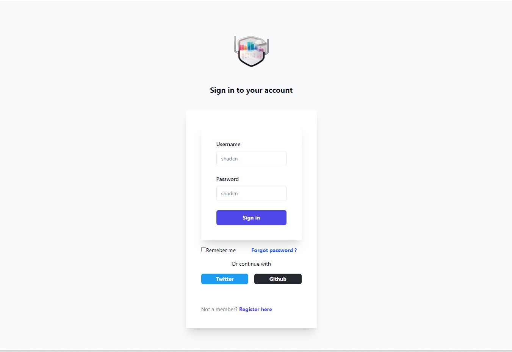
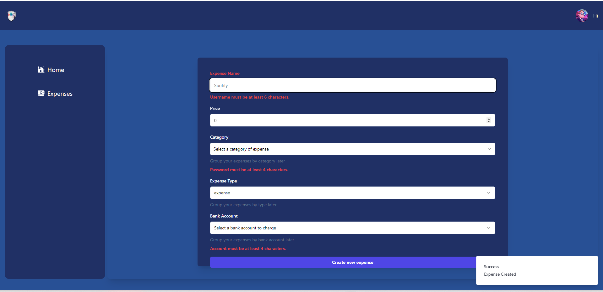
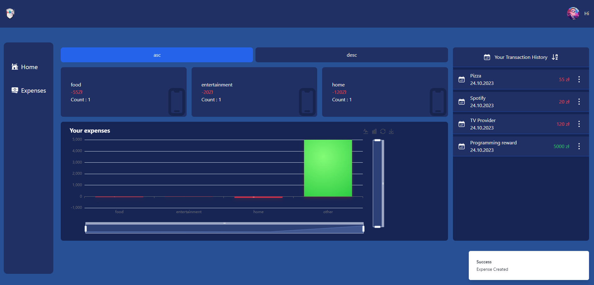
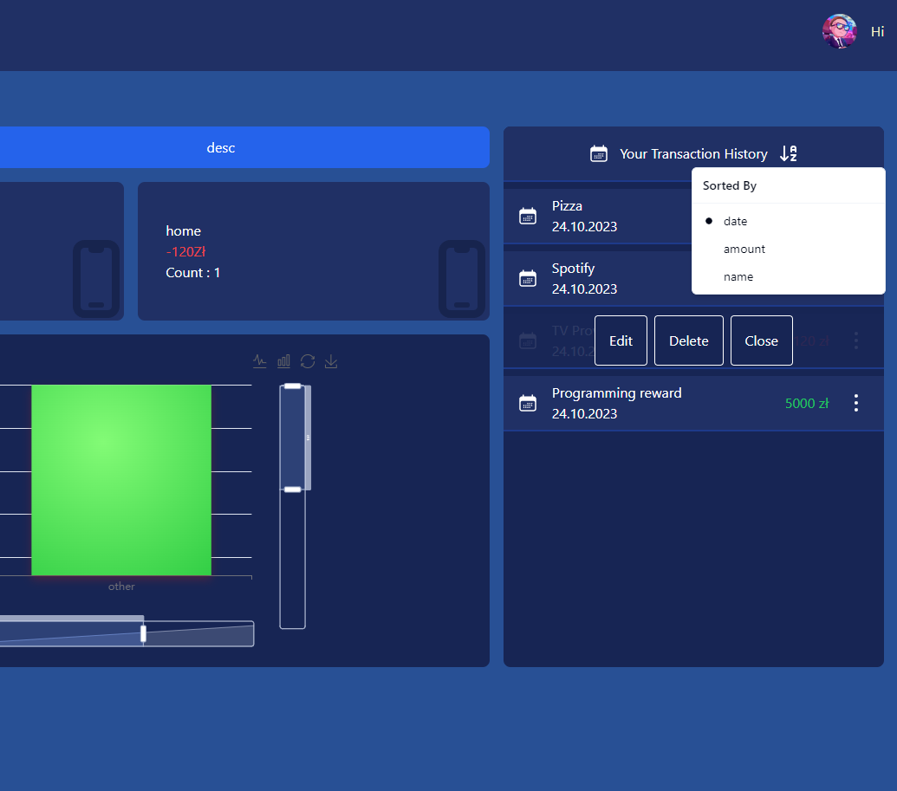
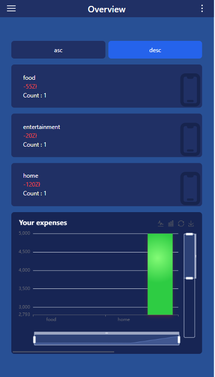
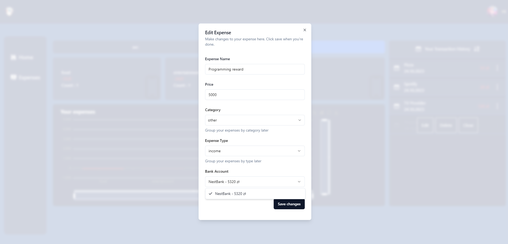
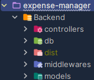

## Fully responsive fullstack app where user can manage his expenses









## Features
-Sign in\
-Sign up\
-Expenses assigned to specific user and his bank account\
-User can create expense/income assigned to his bank account\
-Bank Account balance is kept up to date during expenses and income\
-Users can sort expenses by the category on which they spend the most\
-Users can sort expenses by name, price and date added\
-The user can edit/delete previously created expenses, keeping the bank balance up to date\
-The user has a chart that shows the amounts of expenses / revenues per category.\
-The graph is fully zoomable and can be changed from linear and vice versa by clicking on the icon.\
-The chart can be downloaded to the computer in png format by clicking on the icon.


## Getting Started
1) Download Project
2) Rename ".env.example" file in backend and root directory to ".env" and replace with your content
3) Install dependencies:
```bash
npm install
```
4) Run Build command:
```bash
npm run build
```
5) Move "dist" folder into "backend" folder 
cause frontend is served from backend.
   


6) Run the server:
```bash
npm run start
```


Open [http://localhost:5001](http://localhost:5001) with your browser to see the result.

